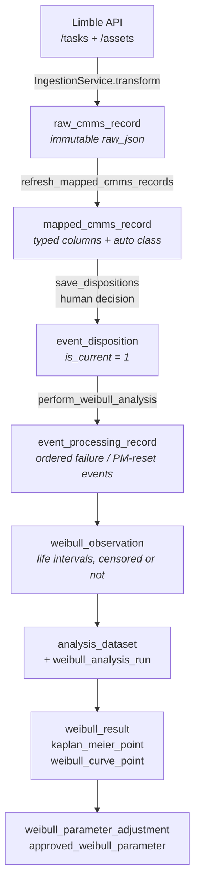

# GREMLIN.db — structure, and how services talk to it

A working guide to the single SQLite file behind GREMLIN: what is in it, how the
data moves through it, and the rules a service has to follow to read or write it.

- [1. The file](#1-the-file)
- [2. How the schema is defined](#2-how-the-schema-is-defined)
- [3. The tables at a glance](#3-the-tables-at-a-glance)
- [4. The pipeline](#4-the-pipeline)
- [5. Table reference by layer](#5-table-reference-by-layer)
- [6. How a service calls the database](#6-how-a-service-calls-the-database)
- [7. Wiring a service into Flask](#7-wiring-a-service-into-flask)
- [8. Changing the schema](#8-changing-the-schema)
- [9. Inspecting a real database](#9-inspecting-a-real-database)
- [10. Rules and gotchas](#10-rules-and-gotchas)

---

## 1. The file

GREMLIN.db is one SQLite file. There is no server, no ORM, and no connection
pool — every access opens a short-lived `sqlite3` connection and closes it.

**Location.** One path, resolved the same way everywhere:

| Order | Source | Value |
| --- | --- | --- |
| 1 | `GREMLIN_DB_PATH` environment variable | whatever you set |
| 2 | `DEFAULT_DB_PATH` (`services/life_data_service.py:36`) | `C:\GREMLIN\GREMLIN.db` |

GREMLIN no longer probes drive letters or UNC shares for the database — it opens
this one path. `app.py:103` (`_configured_db_path`) is the single resolver the web
app uses, so every error message names the file that was actually tried.

Guard rail worth knowing: with **no** `GREMLIN_DB_PATH` set, `app.py:114` refuses
to open a database that does not already exist rather than letting SQLite create
an empty one. On Linux the Windows default path is just an ordinary relative
filename, so a silent miss would otherwise look like a working-but-empty app.

**Operating assumptions.** The file is expected to live on a shared drive with
several people (and the desktop GUI) pointed at it. That drives three choices you
will see repeated in every write path:

- **Rollback journal, not WAL** (`PRAGMA journal_mode = DELETE`). WAL is unsafe on
  many network filesystems.
- **`BEGIN IMMEDIATE`** to reserve the single writer slot up front, rather than
  discovering the lock halfway through a transaction.
- **30-second busy timeout** (`DB_WRITE_TIMEOUT_SECONDS`), so another user's write
  gets time to finish instead of failing instantly.

---

## 2. How the schema is defined

**There is no `.sql` file.** The shape of GREMLIN.db exists only in Python, split
across two owners:

| Owner | Creates | Entry point |
| --- | --- | --- |
| `repositories/raw_repo.py` | `import_batch`, `raw_cmms_record` | `RawRepository.ensure_schema()` (`:113`) |
| `services/life_data_service.py` | the other 21 tables | `LifeDataService.ensure_schema()` (`:309`) |

A fresh database built by both has **23 tables, 64 indexes, 0 views, 0 triggers**.
`LifeDataService` alone builds 21 — it does *not* create the raw import tables,
because it is a consumer of them.

Both bootstraps are deliberately **additive**:

- `CREATE TABLE IF NOT EXISTS` / `CREATE INDEX IF NOT EXISTS` only.
- New columns arrive through `ALTER TABLE ... ADD COLUMN` in
  `_migrate_rel_disposition_schema` (`services/life_data_service.py:784`).
- Nothing is ever dropped, renamed, or rewritten.

The consequence is **drift**: a long-lived GREMLIN.db carries legacy columns the
app stopped using, tables from removed features (the `availability_*` set, whose
code now lives only under `Reference/`), and — if it predates a migration —
possibly missing newer columns. Reading the source therefore does *not* tell you
what is in a given file. Section 9 covers how to ask the file itself.

`RawRepository` takes this further and is **schema-aware at runtime**: it inspects
`PRAGMA table_info` before every insert and only writes columns that exist, filling
any unknown `NOT NULL` column with a zero value. That is why a sync never fails on
a legacy column like `source_row_number` that the application no longer cares about.

---

## 3. The tables at a glance

| Layer | Tables | Written by |
| --- | --- | --- |
| Raw import | `import_batch`, `raw_cmms_record` | `RawRepository` |
| Mapped | `mapped_cmms_record` | `LifeDataService.refresh_mapped_cmms_records` |
| Taxonomy | `failure_mode`, `failure_mechanism`, `asset_failure_mode_option`, `asset_failure_mechanism_option`, `modeled_population` | disposition saves |
| Disposition | `event_disposition` | `LifeDataService.save_disposition(s)` |
| Life basis | `life_basis`, `asset_schedule_class`, `schedule_exception` | seeded by `ensure_schema` |
| Event processing | `event_processing_record`, `weibull_observation` | `perform_weibull_analysis` |
| Analysis | `analysis_dataset`, `analysis_dataset_member`, `weibull_analysis_run` | `perform_weibull_analysis` |
| Results | `weibull_result`, `kaplan_meier_point`, `weibull_curve_point` | `perform_weibull_analysis` |
| Approval | `weibull_parameter_adjustment`, `approved_weibull_parameter`, `weibull_report_log` | adjustment / report actions |

---

## 4. The pipeline

Data flows one direction. Each stage is derived from the one above it and can be
rebuilt from it; the only irreplaceable layer is `raw_cmms_record.raw_json`.



### Stage by stage

**1. Limble → `raw_cmms_record`** (`services/ingestion_service.py:59`)

`IngestionService.sync_all` fetches tasks, drops template rows, enriches them from
`/assets`, and calls `RawRepository.upsert_records`. The transform keeps the whole
API payload and adds a few derived keys the downstream mapper reads: `Asset Number`
(from `assetID`), the asset hierarchy fields, and ISO-8601 `*_Final` date strings
alongside the original Unix timestamps.

Upserts are keyed on the Limble `taskID`, with a SHA-256 content hash to skip
unchanged tasks. Two behaviours matter:

- A refresh is **additive**, never destructive. A narrow `/tasks` payload that omits
  completion notes or downtime does not blank the stored values
  (`_merge_preserved_fields`, `repositories/raw_repo.py:436`).
- Asset-identity fields stay **pinned** to their curated values, and new tasks get
  relabelled from a bare numeric `assetID` to the curated `Asset Number` that
  history uses (`_build_asset_number_bridge`, `:503`).

**2. `raw_cmms_record` → `mapped_cmms_record`** (`life_data_service.py:940`)

`refresh_mapped_cmms_records` parses each `raw_json` into 50-odd typed columns,
normalises downtime (Limble reports **seconds**; the mapper stores minutes and
hours), and applies the keyword classifier that sets `record_class_auto`,
`is_pm_candidate`, and `is_corrective_wo_candidate`.

It only re-maps rows whose `raw_content_hash` or `mapping_version` changed, and it
**never overwrites `record_class_final`** — that column belongs to the human.
Bumping `_MAPPING_VERSION` (`:127`, currently `v2`) forces a one-time remap of every
row on the next service construction.

**3. `mapped_cmms_record` → `event_disposition`** (`life_data_service.py:3735`)

The only human-authored stage. Each save retires the previous current row
(`UPDATE ... SET is_current = 0`) and inserts a new one, so dispositions are an
append-only history with exactly one current row per record — enforced by the
partial unique index `ux_event_disposition_one_current`.

A save also, as needed: creates `failure_mode` / `failure_mechanism` rows from typed
text, records the asset's reusable picks in `asset_failure_*_option`, creates or
finds the `modeled_population`, and writes `record_class_final` back onto
`mapped_cmms_record`.

Two derived flags decide what analysis sees later:

| Column | Set to 1 when |
| --- | --- |
| `include_in_event_processing` | category is `INCLUDED_FAILURE`, `INCLUDED_CENSORED_ASSET_EVENT`, or `INCLUDED_PM_RESET_EVENT` |
| `include_in_weibull_candidate` | WO `INCLUDED_FAILURE`, or PM `INCLUDED_PM_RESET_EVENT` with `APPROVED_RESET` (forced to 0 for excluded/rejected categories) |

**4. Dispositions → events → observations → fit** (`life_data_service.py:3914`)

`perform_weibull_analysis(asset_number, grouping_level=..., failure_mode_id=...)`
runs the whole tail in **one write transaction**:

1. Resolve or create the `modeled_population` for the asset + mode (+ mechanism).
2. `_refresh_event_processing` — delete this population's prior artifacts, then
   insert one `event_processing_record` per included, dated disposition, ordered by
   date and numbered with `weibull_sequence_number`.
3. `_refresh_observations` — walk consecutive events into life intervals. A gap
   ending in a failure becomes `COMPLETED_FAILURE_LIFE`; one ending in a PM reset
   becomes `PM_RESET_CENSORED_LIFE`; the tail from the last event to the analysis
   cutoff becomes `RIGHT_CENSORED_LIFE`. Hours are schedule-adjusted using
   `asset_schedule_class`.
4. Insert `analysis_dataset` + `analysis_dataset_member`, then `weibull_analysis_run`.
5. Fit 2-parameter Weibull by MLE and write `weibull_result`, plus
   `kaplan_meier_point` and `weibull_curve_point` for the charts.

Steps 2 and 3 are **rebuilds, not appends**: `_delete_population_weibull_artifacts`
clears the population's downstream rows first, so re-running an analysis replaces
its results rather than accumulating them.

---

## 5. Table reference by layer

Column lists below are the notable ones, not the complete set — run
`tools/dump_schema.py` (section 9) for the full, file-accurate listing.

### Raw import — owned by `RawRepository`

**`import_batch`** — one row per sync run.
`import_batch_id` PK · `source_system` (`'Limble'`) · `status`
(`STARTED` → `COMPLETED` / `FAILED`) · `import_started_at` · `import_completed_at` ·
`raw_row_count` · `notes`. The `source_file_*` columns are inert leftovers from the
Excel importer era.

**`raw_cmms_record`** — one row per Limble task; the system of record.
`raw_record_id` PK · `import_batch_id` → `import_batch` · `source_record_id` (the
Limble `taskID`) · **`raw_json`** (the full payload) · `raw_content_hash` ·
`imported_at` / `updated_at`. `row_hash`, `source_record_uid`, `source_work_order`,
`source_row_number` are legacy columns kept populated so old `NOT NULL` constraints
still pass.

> `raw_json` is never modified by the analysis layers. Everything downstream can be
> deleted and rebuilt from it — except human dispositions.

### Mapped

**`mapped_cmms_record`** — 52 columns, one per raw row, `UNIQUE (raw_record_id)`.

- Identity: `mapped_record_id` PK · `raw_record_id` → `raw_cmms_record` ·
  `import_batch_id` · `task_id` · `task_name`
- Asset: `asset_number` (**the key every screen groups by**) · `asset_name` ·
  `immediate_parent_asset_*` · `root_asset_*` · `wo_asset_level`
- Dates, each stored three ways: `*_raw` (Unix), `*_datetime_raw`, `*_final` (ISO —
  the one analysis parses), for created / start / due / completed
- Text: `completion_notes` · `requestor_description` · `request_title` ·
  `description_raw`
- Downtime: `downtime_raw` (as Limble sent it, seconds) · `downtime_minutes` ·
  `downtime_hours`
- Classification: `record_class_auto` (mapper's guess) · **`record_class_final`**
  (human's answer, preserved across remaps) · `classification_reason` ·
  `is_pm_candidate` · `is_corrective_wo_candidate` · `is_completed`
- Provenance: `raw_content_hash` · `mapped_at` · `mapping_version`

### Taxonomy

**`failure_mode`** — `failure_mode_id` PK · `failure_mode_name` UNIQUE · `is_active`.
**`failure_mechanism`** — `failure_mechanism_id` PK · `failure_mechanism_name` ·
`failure_mode_id` (a mechanism belongs to at most one mode) · `is_active`. Unique on
`(name, failure_mode_id)`.

**`asset_failure_mode_option` / `asset_failure_mechanism_option`** — per-asset
"recently used" lists that drive the disposition dropdowns. Unique on
`(asset_number, failure_mode_id)` / `(asset_number, failure_mechanism_id)`, with
`use_count` and `last_used_at` maintained on every save. A PM reset target must
already exist as a WO-dispositioned option for that asset.

**`modeled_population`** — the analysis grouping: asset + failure mode
(+ mechanism). `grouping_level_used` is `FAILURE_MODE`, `FAILURE_MECHANISM`,
`ASSET_ONLY`, or `UNKNOWN`. Everything from `event_processing_record` down hangs off
`modeled_population_id`.

### Disposition

**`event_disposition`** — append-only decision history.
`event_disposition_id` PK · `mapped_record_id` → `mapped_cmms_record` ·
`modeled_population_id` · `record_class_final` · `disposition_category` (CHECK
constrained) · `include_in_event_processing` · `include_in_weibull_candidate` ·
`failure_mode_id` / `failure_mechanism_id` (WO) ·
`reset_target_failure_mode_id` / `reset_target_failure_mechanism_id` (PM) ·
`pm_reset_inclusion_decision` · `pm_reset_renewal_rationale` · `disposition_notes` ·
`decided_at` · **`is_current`**.

Categories, by kind (`WO_DISPOSITION_CATEGORIES` / `PM_DISPOSITION_CATEGORIES` in
`life_data_service.py:85`):

| WO | PM |
| --- | --- |
| `INCLUDED_FAILURE` | `INCLUDED_PM_RESET_EVENT` |
| `INCLUDED_CENSORED_ASSET_EVENT` | `PM_CONTEXT_ONLY` |
| `EXCLUDED_NON_FAILURE` | `REJECTED_PM_RESET` |
| `HELD_AMBIGUOUS` | `HELD_AMBIGUOUS` |
| `EXCLUDED_MIXED_CONTAMINATING` | `EXCLUDED_NON_FAILURE` |
| `UNKNOWN` | `UNKNOWN` |

**Always filter reads with `WHERE is_current = 1`.** Every query in the service does.

### Life basis and schedule

**`life_basis`** — seeded with `RAW_ELAPSED_HOURS`,
`SCHEDULE_ADJUSTED_ELAPSED_HOURS`, `TRUE_OPERATING_HOURS`, `CYCLES`, `STARTS`.
**`asset_schedule_class`** — seeded with `24H_MON_FRI`, `20H_MON_FRI`,
`RAW_ELAPSED_ONLY`; supplies `hours_per_day` and `exclude_weekends` to the interval
maths. **`schedule_exception`** — per-asset shutdown/exception windows.

### Event processing and observations

**`event_processing_record`** — one row per included disposition, in date order.
`event_role` (`FAILURE_EVENT`, `PM_RESET_EVENT`, `INSTALLATION_EVENT`,
`REPLACEMENT_EVENT`, `CENSOR_CUTOFF_EVENT`, `TRACEABILITY_ONLY`, `EXCLUDED_EVENT`) ·
`completed_date_parsed` · `weibull_sequence_number` ·
`previous_same_population_event_id` · `is_valid_life_start` / `is_valid_life_end`.

**`weibull_observation`** — one row per life interval.
`observation_type` (`COMPLETED_FAILURE_LIFE`, `RIGHT_CENSORED_LIFE`,
`PM_RESET_COMPLETED_LIFE`, `PM_RESET_CENSORED_LIFE`) · `start_event_processing_id` /
`end_event_processing_id` · `life_hours_raw_elapsed` · the `excluded_*_hours`
breakdown · **`life_hours_for_weibull`** (what the fit consumes) ·
`failure_indicator` · `is_right_censored` · `is_usable`.

### Analysis and results

**`analysis_dataset`** + **`analysis_dataset_member`** — the frozen set of
observations for one run (`included_in_fit` per member).
**`weibull_analysis_run`** — `fit_method` (`2P_WEIBULL_MLE`), `empirical_method`
(`KAPLAN_MEIER`), `run_datetime`, `code_version`.
**`weibull_result`** — `beta_mle` / `eta_mle` and their CIs, `log_likelihood`, `aic`,
`bic`, `failure_count`, `censored_count`, `mean_time_to_failure`, `b10_life`,
`b50_life`, plus the narrative fields.
**`kaplan_meier_point`** / **`weibull_curve_point`** — chart series, cascade-deleted
with their run.

### Approval

**`weibull_parameter_adjustment`** — manual beta/eta overrides, one current row per
result (partial unique index). **`approved_weibull_parameter`** — the sign-off.
**`weibull_report_log`** — issued report numbers per asset.

---

## 6. How a service calls the database

Three classes own database access. Pick by intent:

| Class | Mode | Use when |
| --- | --- | --- |
| `LifeDataService` (`services/life_data_service.py`) | read + write | Anything in the mapped → analysis path |
| `RawRepository` (`repositories/raw_repo.py`) | write | Importing raw payloads |
| `SchemaService` (`services/schema_service.py`) | **read-only, hard-enforced** | Introspection, dev tooling, ad-hoc queries |

The `repositories/{analysis,failure,metrics}_repo.py` classes are unimplemented
placeholders returning empty structures — they do not touch SQLite yet.

### 6.1 Constructing `LifeDataService`

```python
from services.life_data_service import LifeDataService

service = LifeDataService(db_path, refresh_on_startup=False)
```

The constructor is **not** cheap and it is **not** read-only:

1. It calls `ensure_schema()`, which opens a write transaction and creates or
   migrates the 21 downstream tables.
2. If `refresh_on_startup=True`, or if any row's `mapping_version` is stale, it
   re-maps `raw_cmms_record` into `mapped_cmms_record`.

So build it **once** and share it. The web app and the desktop GUI both pass
`refresh_on_startup=False` and let the user trigger a refresh explicitly; the stale
`mapping_version` check still runs, which is how a mapper fix reaches an existing
database without anyone asking for it.

### 6.2 Reading

`connect()` (`:214`) returns a `ClosingSqliteConnection` — a subclass whose context
manager actually **closes** the handle, unlike the stock one which only commits or
rolls back. Use `with`; do not hold connections across requests.

```python
def mapped_record_count(self) -> int:
    with self.connect() as conn:
        if not self._table_exists(conn, "mapped_cmms_record"):
            return 0
        return int(conn.execute("SELECT COUNT(*) AS count FROM mapped_cmms_record").fetchone()["count"] or 0)
```

Every read connection sets `row_factory = sqlite3.Row` (index by column name),
`foreign_keys = ON`, a 30s `busy_timeout`, `synchronous = FULL`, and a 64 MB cache.

Because the file drifts, guard against tables and columns that may not exist —
`_table_exists` / `_column_exists` — rather than assuming the current schema.

### 6.3 Writing

Always through `write_connection()` (`:226`). Never open a bare `sqlite3.connect`
for a write.

```python
def save_something(self, ...) -> None:
    with self.write_connection() as conn:
        conn.execute("UPDATE ... WHERE ...", params)
        conn.execute("INSERT INTO ...", params)
    # commit on clean exit, rollback on exception, close either way
```

What the context manager does for you:

- `PRAGMA journal_mode = DELETE` (shared-drive safe)
- `BEGIN IMMEDIATE` — tried first with `busy_timeout = 0` so a lock is detected
  immediately, then retried with the full 30s timeout after notifying any registered
  lock-wait callback (`database_lock_wait_callback`, `:42` — the desktop GUI uses it
  to show "waiting for another user")
- commit / rollback / close
- translation of `sqlite3.Error` and `OSError` into **`DatabaseWriteError`**, whose
  message names the database path, a plain-language reason (locked, permissions,
  missing path, disk full), and what the user should do next

Batch related writes into **one** transaction. `save_dispositions` writes N rows in a
single `write_connection` block rather than N blocks, because each block costs a
round trip to the writer slot on a shared drive.

### 6.4 Read-only access via `SchemaService`

For anything that only inspects, use `SchemaService` — it cannot write, by two
independent mechanisms:

- **`mode=ro` URI connection.** Cannot take the writer slot, so a dev query can
  never stall other users mid-transaction.
- **A default-deny SQLite authorizer** (`:157`). `mode=ro` still permits
  `VACUUM INTO 'static/copy.db'` and `ATTACH DATABASE`, either of which would drop a
  full copy of the database somewhere Flask serves. The authorizer allows only
  reads, function calls, and a fixed list of informational pragmas, and SQLite
  enforces it at statement-compile time — so it cannot be dodged by formatting or by
  nesting the write in a subquery.

It also bounds resource use: 15s query deadline via a progress handler, 100 rows per
page (1000 max), 2000 chars per cell, an 8 MB per-value ceiling and a 32 MB
per-result budget, and lenient UTF-8 decoding so one mis-encoded legacy row does not
make a whole table unbrowsable.

Public API: `overview()`, `tables()`, `table_detail(table)`, `table_rows(...)`,
`run_query(sql)`, `pipeline()`, `drift_report()`.

### 6.5 Orchestrating: `IngestionService`

`IngestionService` (`services/ingestion_service.py:36`) is the model for a service
that composes an integration with a repository. It takes its collaborators by
constructor injection and owns no SQL of its own:

```python
service = IngestionService(
    limble_client=LimbleClient(config),
    raw_repo=RawRepository(db_path),
    fetch_assets=True,
    refresh_mapping=True,
)
summary = service.sync_all(updated_since=None, dry_run=False)
```

`sync_all` shows the batch lifecycle to copy: `ensure_schema()` → `start_batch()` →
`upsert_records()` → `complete_batch(status=...)` in a `try/except` that marks the
batch `FAILED` before re-raising. It then refreshes the mapped layer — but treats
that as best-effort, checking preconditions first and returning an honest
`mapping_ok` / `mapping_note` rather than reporting a no-op mapping as success. A
good raw import is never lost to a mapping problem.

---

## 7. Wiring a service into Flask

`app.py` follows one pattern; match it for anything new.

**Lazy module-level singleton.** The service is built on first use, not at import,
so a missing database surfaces as a JSON error on the page instead of crashing the
process at startup:

```python
_life_data_service: LifeDataService | None = None
_life_data_service_error: str | None = None

def get_life_data_service() -> LifeDataService:
    global _life_data_service, _life_data_service_error
    if _life_data_service is not None:
        return _life_data_service
    db_path = _configured_db_path()
    ...
    _life_data_service = LifeDataService(db_path=db_path, refresh_on_startup=False)
    return _life_data_service
```

`get_schema_service()` (`app.py:649`) does the same, and additionally rebuilds if
`_configured_db_path()` changed.

**A decorator that normalises errors.** `life_data_api` (`app.py:149`) maps
exceptions to status codes once, so route bodies stay free of try/except:

| Exception | Status |
| --- | --- |
| `LifeDataApiError` | its own `status_code` |
| `DatabaseWriteError` | 503 |
| `ValueError` (service validation) | 400 |
| anything else | 500 |

**A route that just calls the service:**

```python
@app.route("/life-data-analysis/api/summary")
@life_data_api
def api_summary():
    service = _service_or_api_error()      # 503 with the DB path if unopenable
    asset_number = _required_asset()       # 400 if missing
    summary = service.summary_for_asset(asset_number)
    return jsonify({...})
```

Dev endpoints use `dev_api` instead, which additionally requires the PIN session and
maps `SchemaServiceError` to 400.

**Checklist for a new database-backed service**

1. Take `db_path` in the constructor; never read `GREMLIN_DB_PATH` yourself — accept
   the resolved path from the caller.
2. Reads → `with self.connect()`. Writes → `with self.write_connection()`.
3. Guard on `_table_exists` / `_column_exists` before touching anything that
   migrations added.
4. Raise `ValueError` for user-fixable input problems; let `DatabaseWriteError`
   propagate untouched — the API layer already renders it well.
5. Expose it through a lazy singleton getter in `app.py` and decorate routes.
6. If it needs new tables or columns, add them to `ensure_schema` /
   `_migrate_rel_disposition_schema` (section 8) — never as a side effect elsewhere.

---

## 8. Changing the schema

**Adding a table.** Append a `CREATE TABLE IF NOT EXISTS` (and its indexes) to the
`executescript` block in `LifeDataService.ensure_schema` (`:314`). It appears in
existing databases the next time the service is constructed.

**Adding a column to an existing table.** `CREATE TABLE IF NOT EXISTS` does nothing
on a table that already exists, so a new column needs **both**:

1. the column in the `CREATE TABLE` statement (for fresh databases), and
2. an entry in `_migrate_rel_disposition_schema` (`:784`) for existing ones:

```python
required_mapped_columns = {
    "downtime_hours": "REAL",
    "mapping_version": "TEXT NOT NULL DEFAULT 'v1'",
}
for column, ddl in required_mapped_columns.items():
    if not self._column_exists(conn, "mapped_cmms_record", column):
        conn.execute(f"ALTER TABLE mapped_cmms_record ADD COLUMN {column} {ddl}")
```

Pick the default so that existing rows are correctly classified as stale — that is
exactly why `mapping_version` defaults to `'v1'` while the current version is `v2`.

**Changing mapping logic.** Bump `_MAPPING_VERSION` (`:127`). Every row is then
re-derived from stored `raw_json` on the next service construction, with
`record_class_final` preserved.

**What you cannot do:** drop or rename a column, change a type, or tighten a
constraint. Old columns stay; add a new one and stop reading the old one.

The drift report keeps itself honest by building a throwaway database with the
**real** bootstrap code and introspecting it (`_reference_schema`,
`schema_service.py:797`) — so it cannot rot against a duplicated table list.

---

## 9. Inspecting a real database

**CLI — the fastest full picture:**

```bash
python tools/dump_schema.py                          # GREMLIN_DB_PATH or the default
python tools/dump_schema.py --db /path/GREMLIN.db
python tools/dump_schema.py --db /path/GREMLIN.db --out docs/schema.md
```

Output: file stats, pipeline row counts, the drift report, then every table with
columns, foreign keys, indexes, and per-table drift.

**Developer dashboard** — `/developer`, PIN-gated (`GREMLIN_DEV_PIN`, default
`1336`). Same data as the CLI, plus a browsable row viewer and a read-only SQL
console. Endpoints: `/developer/api/{runtime,overview,pipeline,drift,tables}`,
`/developer/api/tables/<table>[/rows]`, `POST /developer/api/query`.

> The PIN is a speed bump, not authentication: the default is a known value in a
> public repository. Treat anyone who can reach the port as able to read the whole
> database.

**Reading the pipeline panel.** Row counts shrink monotonically down the stages, so
**the first stage that is unexpectedly zero is where the problem starts**:

| Zero at | Means |
| --- | --- |
| `raw_cmms_record` | the sync never ran, or credentials/filters excluded everything |
| `mapped_cmms_record` | mapping never ran, or `raw_cmms_record` lacks `raw_record_id` / `import_batch_id` |
| `event_disposition` | nobody has dispositioned this data yet |
| `event_processing_record` | dispositions exist but none are included, or dates failed to parse |
| `weibull_observation` | fewer than two included events, so no interval could be built |
| `weibull_result` | analysis has not been run, or no failure observation exists to fit |

**Ad-hoc from Python:**

```python
from services.schema_service import SchemaService
svc = SchemaService("/path/GREMLIN.db")
svc.pipeline()
svc.run_query("SELECT asset_number, COUNT(*) FROM mapped_cmms_record GROUP BY 1")
```

---

## 10. Rules and gotchas

1. **`raw_json` is sacred.** Never rewrite it from an analysis layer. It is the only
   thing that cannot be regenerated.
2. **Dispositions are the other irreplaceable data.** Everything from
   `event_processing_record` down is derived and gets deleted and rebuilt per
   population on each analysis run.
3. **One writer.** Use `write_connection()`, batch related writes into one
   transaction, and keep transactions short. A long dev query holding the writer slot
   stalls every GREMLIN user.
4. **Never open a write connection for a read-only feature.** Use `SchemaService`.
5. **Always `WHERE is_current = 1`** on `event_disposition`; it is a history table.
6. **`asset_number` is the join key** for every screen — not `asset_id_raw`. The
   ingestion bridge exists precisely to keep new API rows filed under the curated
   number history uses.
7. **Downtime is seconds in `raw_json`.** `_parse_downtime_minutes`
   (`life_data_service.py:1122`) is the single place it is converted. Do not rescale
   at ingestion — that is what the `v2` mapping bump fixed.
8. **Dates: read `*_final`, not `*_raw`.** The Weibull path parses the ISO strings;
   it cannot read Unix integers.
9. **Assume drift.** Check `_table_exists` / `_column_exists` before touching
   anything a migration added, and expect `availability_*` tables in older files —
   that feature's code now lives only under `Reference/`.
10. **`LifeDataService()` writes on construction.** It runs `ensure_schema` and may
    re-map. Do not construct it in a loop or per request.
11. **Foreign keys are ON.** `mapped_cmms_record` has `NOT NULL` FKs to both
    `raw_cmms_record` and `import_batch`, which is why mapping is refused when the
    raw table lacks those columns.
12. **`record_class_final` belongs to the user.** The mapper writes
    `record_class_auto` and preserves the final value across every remap.

---

## Quick reference

```bash
# Point everything at a database
export GREMLIN_DB_PATH=/path/to/GREMLIN.db

# Import from Limble (needs LIMBLE_CLIENT_ID / LIMBLE_CLIENT_SECRET)
python -m jobs.sync_limble
python -m jobs.sync_limble --since 2026-01-01 --no-assets --dry-run
python -m jobs.sync_limble --create          # create the file if absent

# Inspect
python tools/dump_schema.py --out docs/schema.md

# Run the web app (developer dashboard at /developer)
python app.py

# Tests that exercise the database layers
python -m unittest tests.test_raw_repo tests.test_schema_service tests.test_downtime
```

| I want to… | Call |
| --- | --- |
| Import raw Limble data | `IngestionService.sync_all()` |
| Rebuild the mapped layer | `LifeDataService.refresh_mapped_cmms_records()` |
| List assets for a dropdown | `LifeDataService.asset_number_options()` |
| Show disposition rows | `LifeDataService.disposition_rows(asset, kind, ...)` |
| Save decisions | `LifeDataService.save_dispositions([...])` |
| Fit a Weibull | `LifeDataService.perform_weibull_analysis(asset, grouping_level=..., failure_mode_id=...)` |
| Override beta/eta | `LifeDataService.save_parameter_adjustment(result_id, beta, eta, reason)` |
| Inspect the file safely | `SchemaService.overview() / .pipeline() / .drift_report()` |
